# Bitacora de implemetación

Aplicación Node.js + Express demuestra una API simple donde se incluyen procesos de autenticación y observbilidad de errores usando Sentry. Para ello es necesario configurar las variables de entorno con `.evn.example` y ejecutar el script `keypair.sh` para obtener las llaves pem. Una vez configurado, se puede ejecutar la API mediante:

```
npm run dev
```

Para poder generar la token JWT ejecutar:

```
node gen-token.js
```
El token generado tiene como usuario de prueba al ID: "usr_001" (aparece en los Tags de Sentry)

---

### Pruebas: [GET] /v1/account-alpha/balance

#### Acceso no autorizado: Sin Headers

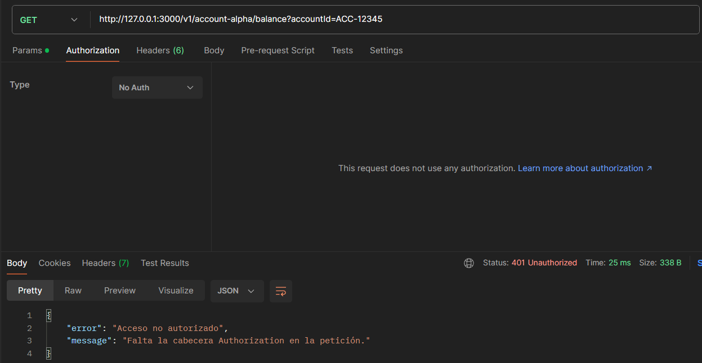

#### Acceso no autorizado: Header que no es Bearer

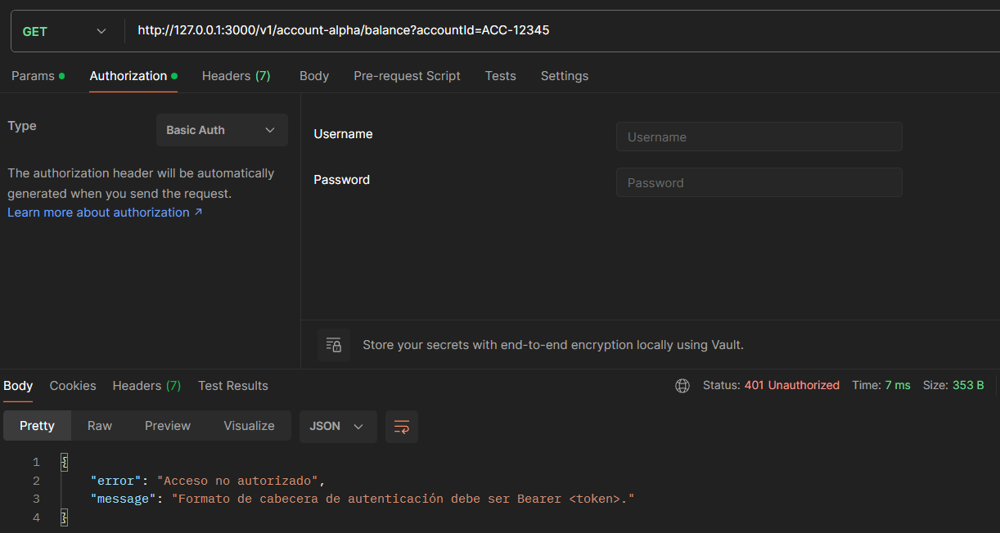

#### Acceso no autorizado: Token inválido

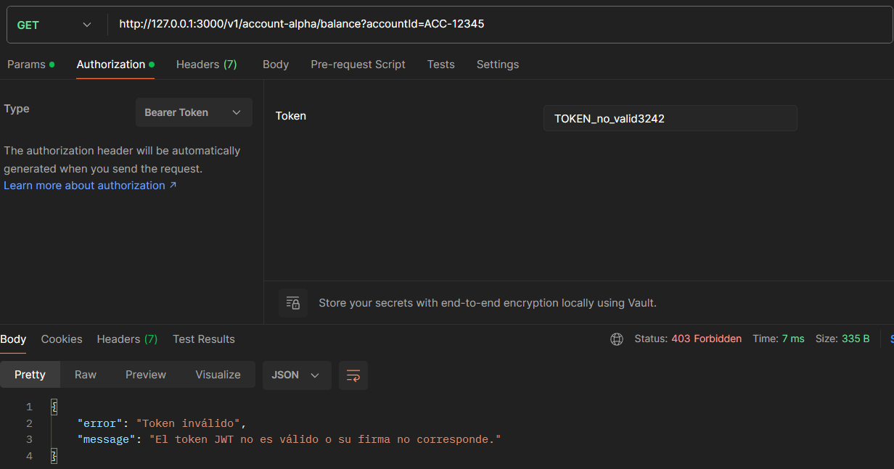

#### Acceso no autorizado: Token expirado

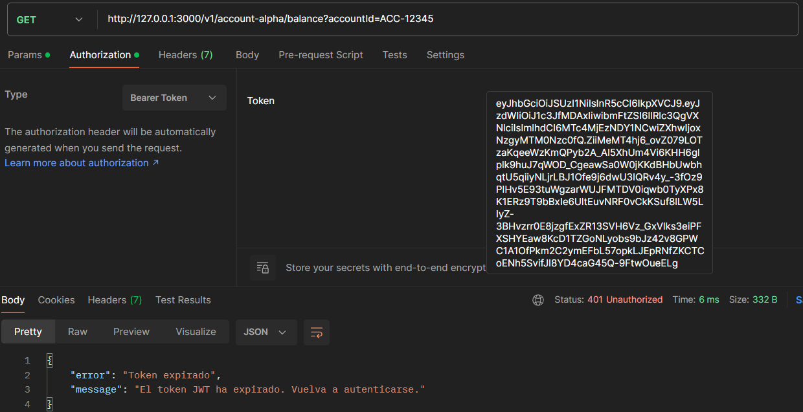

#### Con token válido: Falta query params en ruta

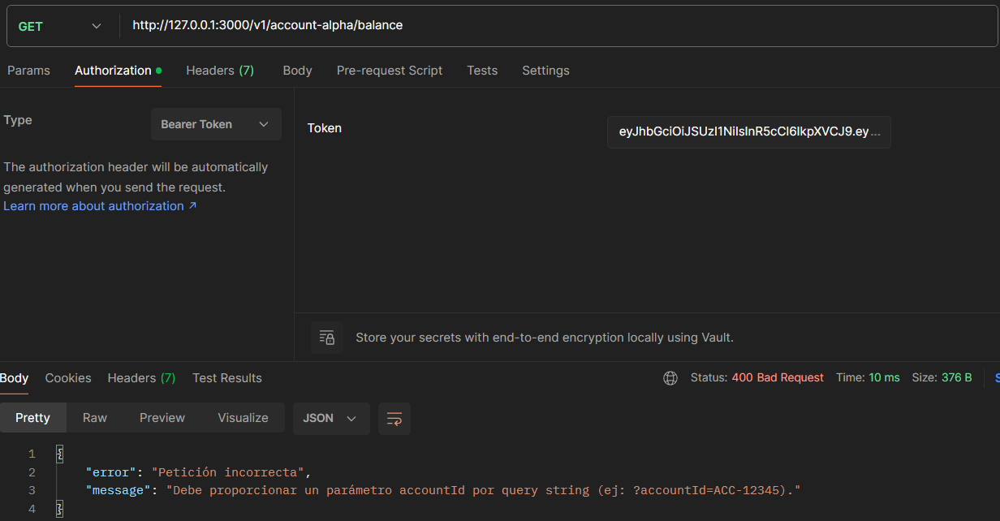

#### Con token válido: AccountId no existe en la DB

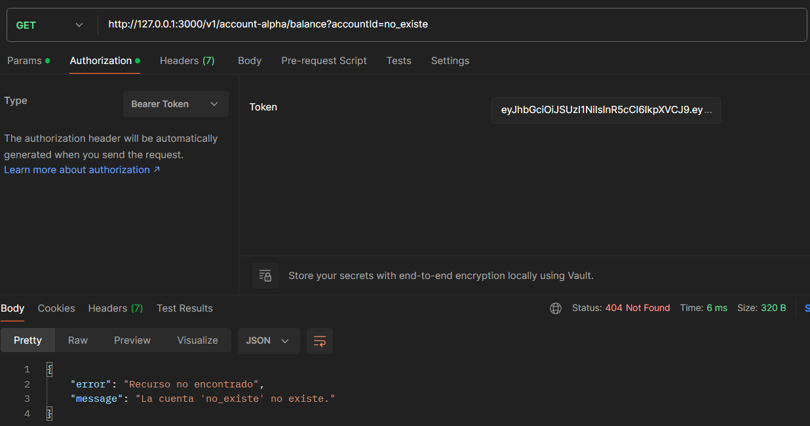

#### Con token válido: Acceso correcto a recurso

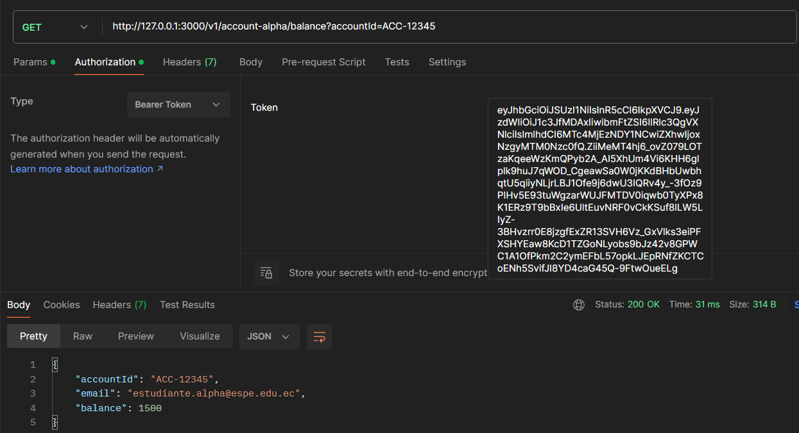


### Pruebas: [POST] /v1/transfer-beta/execute

#### Acceso no autorizado: Token inválido

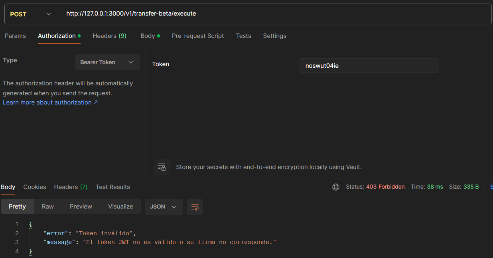

#### Acceso no autorizado: Token expirado

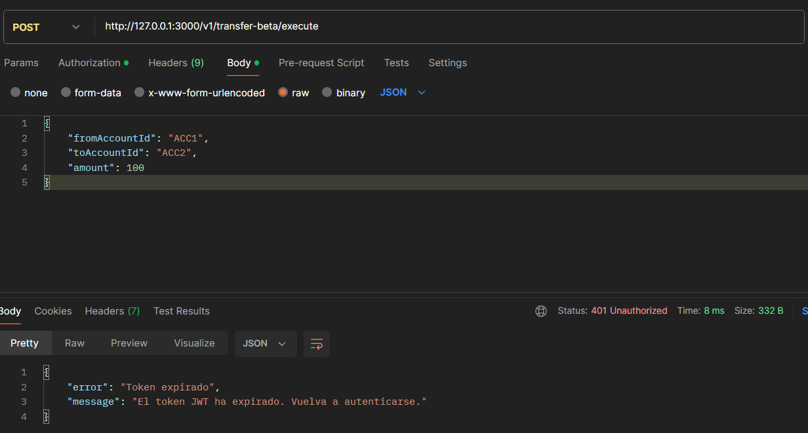

#### Con token válido: Payload incompleto

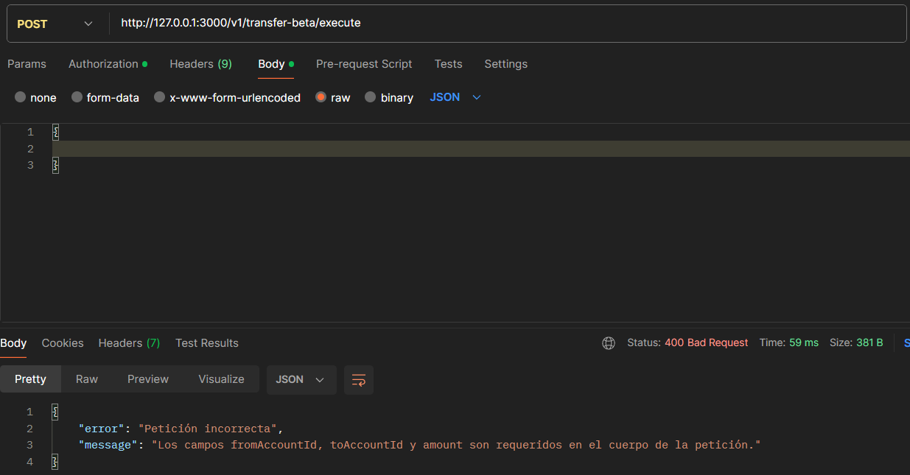

#### Con token válido: Error de fallo en la DB (excepción controlada)

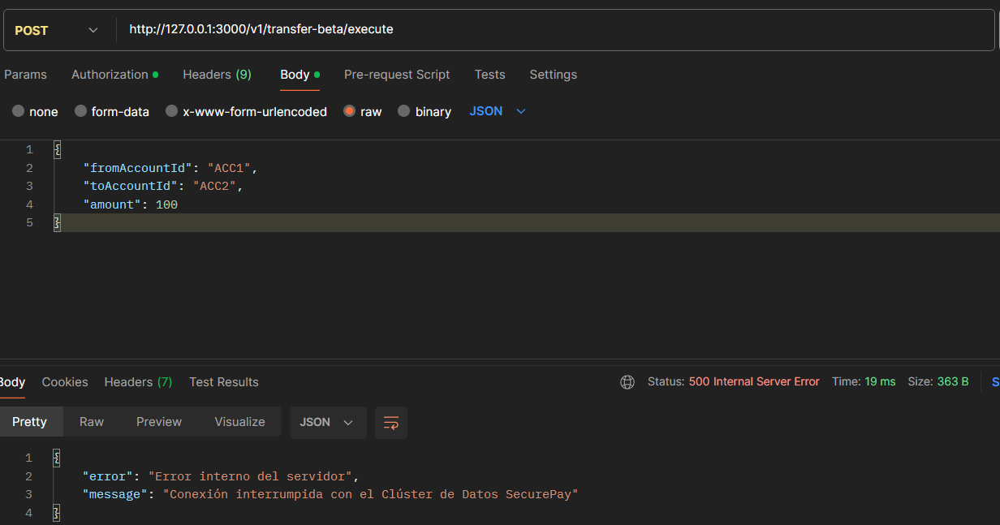

### Captura de errores en Sentry

#### Dashboard principal de errores

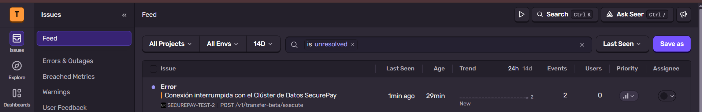

#### Resumen de la petición HTTP

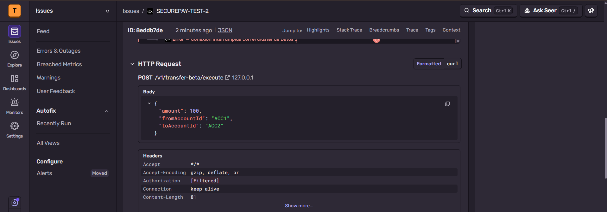

#### Tags resumen y personalizadas

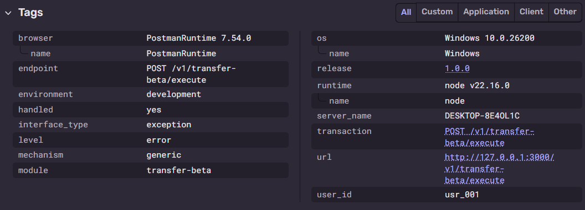
